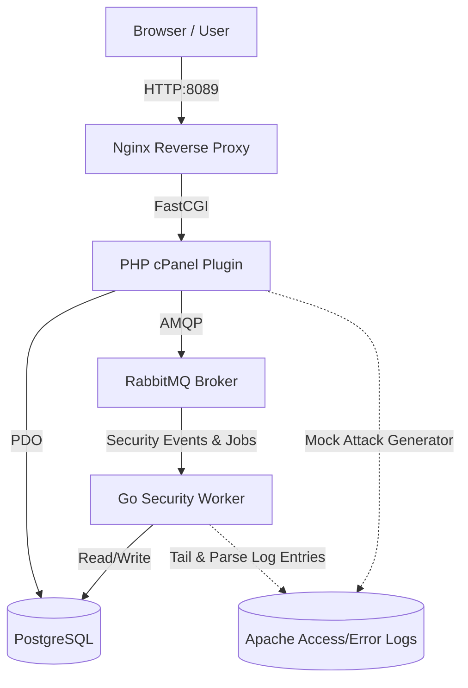

ShieldPanel is a portfolio-grade security integration platform designed to demonstrate the ability to bridge PHP-based hosting panels (simulating cPanel) with scalable backend security services written in Go.

It showcases asynchronous log parsing, threat detection heuristics, and event-driven automation via a Dockerized multi-service topology.

---

## Architecture Overview



The system is composed of the following services:
1. **Nginx Web Server (`nginx`)**: Acts as a reverse proxy exposing port `8089`, serving static assets directly and forwarding PHP requests to the PHP-FPM daemon.
2. **PHP Control Layer (`php-app`)**: Simulates the cPanel plugin environment. It handles database CRUD operations, renders the glassmorphic Dashboard/Settings UI, and dispatches jobs to RabbitMQ.
3. **RabbitMQ Broker (`rabbitmq`)**: Manages the `shieldpanel.events` topic exchange and `security.jobs` queue, routing events such as `scan.requested`, `domain.created`, and `protection.disabled`.
4. **Go Security Worker (`go-worker`)**: A high-performance, asynchronous background worker that consumes RabbitMQ events, parses raw Apache access/error logs from shared directories, runs heuristics rules, and persists findings in the database.
5. **PostgreSQL Database (`postgres`)**: Stores persistent configuration for registered domains, executed scans, event logs, and structured security findings.
6. **Shared Volume (`./shared/logs`)**: Binds raw log files (`access.log`, `error.log`) across containers to simulate server log generation and ingestion.

---

## Technical Features Demonstrated

- **Asynchronous Task Architecture**: Avoids blocking panel requests. Scan executions and domain events are instantly acknowledged by PHP and queued to RabbitMQ, where they are consumed by the Go worker.
- **Resilient Startup Loops**: Implements robust retry loops with exponential backoff on both PHP (PDO helper) and Go (amqp/sql connection dialers) to prevent container crash loops during parallel Compose startup.
- **Graceful Shutdown**: The Go worker captures termination signals (`SIGINT`, `SIGTERM`), cancels the consuming context to reject new jobs, drains in-flight log analyses, and exits cleanly without message loss.
- **Security Heuristics MVP**:
  - **Bot Traffic**: Matches suspicious user-agent strings (e.g. `SemrushBot`, `AhrefsBot`) and alerts on request rate anomalies.
  - **Credential Stuffing**: Detects rapid auth spikes targeting `/wp-login.php` and parses `error.log` for password mismatch messages from the same IP.
  - **XMLRPC Abuse**: Scans for bursts of POST requests to `xmlrpc.php` (common WordPress DDoS and pingback target).
  - **API Scraping**: Tracks aggressive path enumeration patterns and automated fetch libraries (e.g. `Python-urllib`, `Scrapy`).
- ** obsidian glass UI**: Features a sleek glassmorphic dashboard styled using custom CSS variables, hover effects, conic gradients for threat gauges, and AJAX polling for real-time status updates.

---

## Installation & Getting Started

### Prerequisites
- Docker & Docker Compose (v2.x recommended)

### Step 1: Clone and Set Up Log Permissions
Since the containers bind-mount the `./shared/logs/` directory to write mock attacks and parse logs, ensure the directory is world-writable so the web user (`www-data`) inside the container has access:

```bash
chmod -R 777 shared/
```

### Step 2: Boot the Services
Initialize and start all containers in detached mode:

```bash
docker compose up --build -d
```

Confirm that all services are healthy and running:

```bash
docker compose ps
```

### Step 3: Access the Platform
- **ShieldPanel UI**: Open `http://localhost:8089` in your web browser.
- **RabbitMQ Management**: Open `http://localhost:15672` (Credentials: `shieldpanel_mq` / `shieldpanel_mq_pass` as configured in `.env`).

---

## Manual Walkthrough

1. **Dashboard Overview**: Check out the obsidian glass panel. You'll see seed data loaded for `example.com`, `myshop.com`, and `blog.dev`.
2. **Generate Attack Vectors**: Select `example.com` and click **"Generate Attack Traffic"**. This appends simulated attack strings to `shared/logs/access.log` and `shared/logs/error.log`.
3. **Trigger Analysis**: Click **"Trigger Security Scan"**. A progress indicator appears, the task is published to RabbitMQ, processed by the Go worker, and database statuses update.
4. **Inspect Findings**: Once complete, the circular Threat Score transitions, and detailed entries populate the **Incident & Event Logs** showing severity, type, and source IP.
5. **Settings Page**: Switch to the **Policy Settings** tab. Try registering a new domain profile (e.g. `my-new-domain.com`), toggling its protection status (which fires lifecycle event hooks), or deleting a domain.

---

## Database Schema

Registered data is stored in PostgreSQL as defined in `db/init.sql`:
- **`domains`**: Domain metadata, active lifecycle status, and protection state.
- **`scans`**: Historical logs of scan runs, tracking start/completion timestamps, overall threat scores, and risk classifications.
- **`findings`**: Granular records of specific threats identified per scan, mapping metadata, source IP, category, and severity.
- **`events`**: Log of lifecycle hook requests (`domain.created`, `domain.deleted`, `account.suspended`) mapping whether the worker successfully reconciled them.
